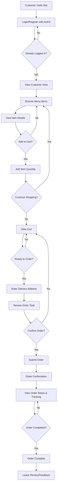
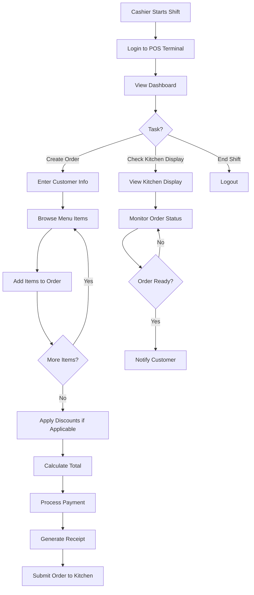
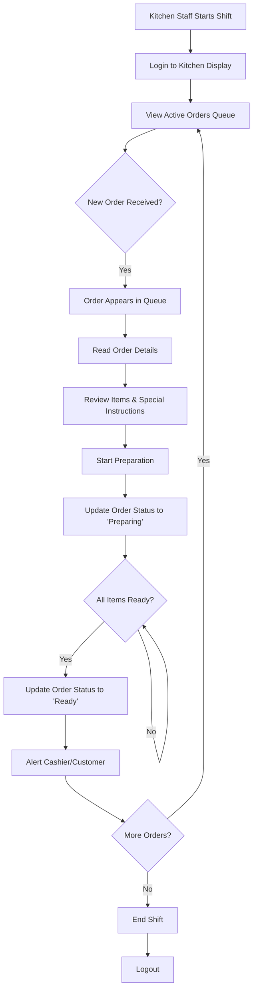
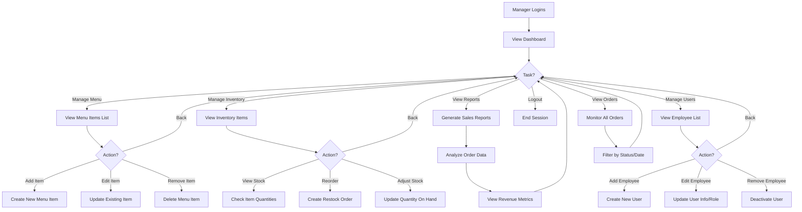
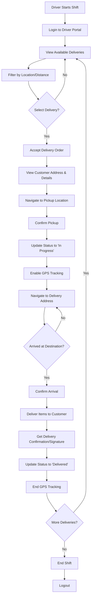
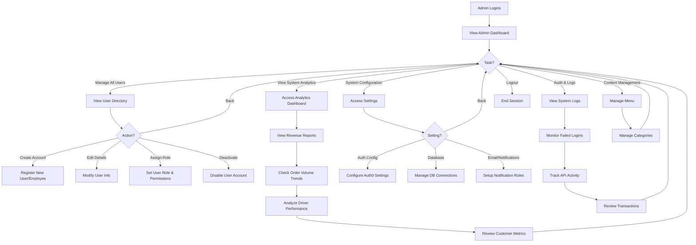
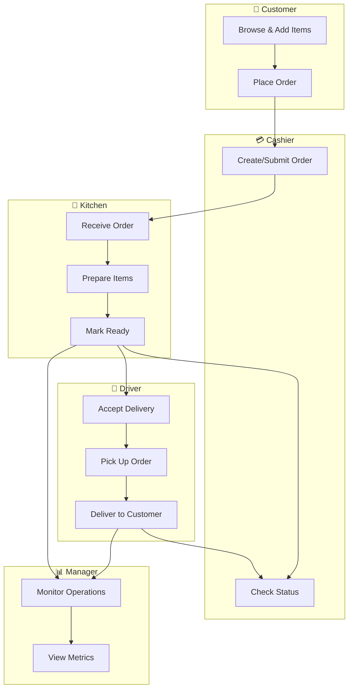
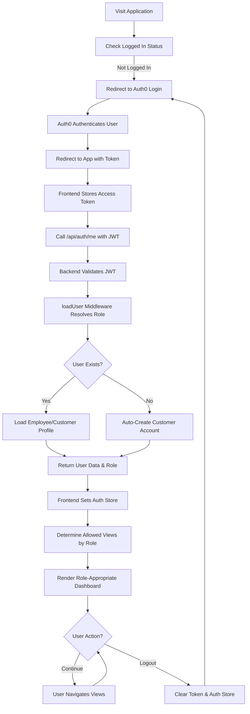
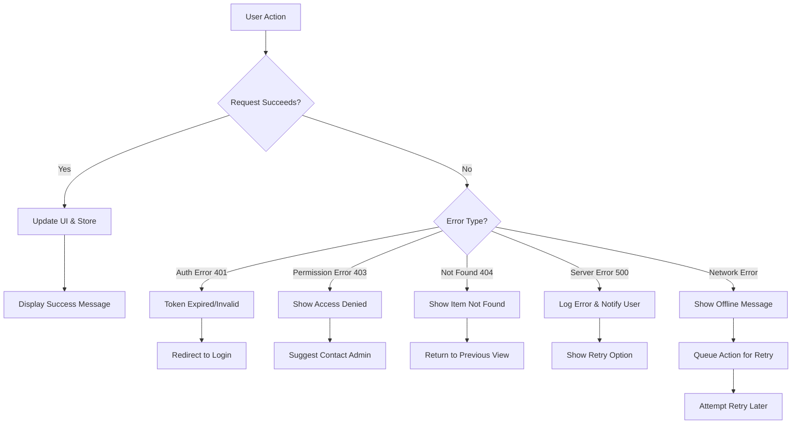

# PopNicPOS User Flows

This document outlines the typical workflow for each user role in the PopNicPOS system.

---

## 1. Customer Flow

**Access Level:** Browse menu, place orders, track deliveries

---

## 2. Cashier Flow

**Access Level:** Create orders, view kitchen display, manage in-store transactions

---

## 3. Kitchen Flow

**Access Level:** View orders, update order status, manage preparation

---

## 4. Manager Flow

**Access Level:** Full POS access + inventory & menu management + user admin

---

## 5. Driver Flow

**Access Level:** View assigned deliveries, broadcast GPS, track delivery status

---

## 6. Administrator Flow

**Access Level:** Full system access, user management, analytics, system configuration

---

## Cross-User Order Lifecycle

---

## Session Flow: Login & Auth

---

## Error Handling & Recovery

---

## Key Takeaways

| Role | Primary Task | Key Views | Main Tools |
|------|-------------|-----------|-----------|
| **Customer** | Browse & order | Customer View, Cart, Tracking | Menu, Map (Leaflet) |
| **Cashier** | Create & process orders | POS Terminal, Kitchen Display | Order entry, Receipt printer |
| **Kitchen** | Prepare food | Kitchen Display, Order Queue | Status updates, Timers |
| **Driver** | Deliver orders | Driver Portal, Map, Delivery List | GPS, Navigation |
| **Manager** | Oversee operations | All views + Menu, Inventory, Users | Reports, Settings |
| **Admin** | System administration | All views + System Config, Logs | Database, Auth, Analytics |

---

## Notes

- All user session flows include **Auth0 authentication** and **JWT token validation**
- Real-time updates via **Socket.io** keep all users synchronized (especially important for kitchen and driver)
- **Role-based access control** ensures users only see views and actions permitted for their role
- **Error handling** gracefully manages auth failures, network issues, and business logic errors
- **Database transactions** ensure order integrity (no partial orders even if system fails mid-creation)
